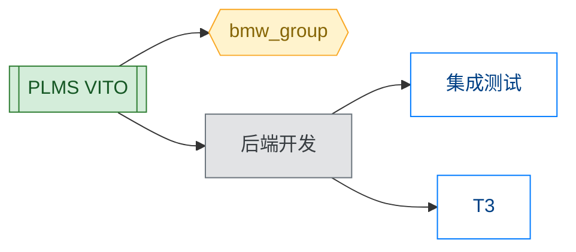

# mermaid-test

```mermaid
graph LR
    T1[["PLMS VITO"]]
    T1 --> T2{{bmw_group}}
    %% T2 --> T3{{"前端开发"}}
    T1 --> T4["后端开发"]
    T4 --> T5["集成测试"]
    T4 --> T3

    click T3 href "https://www.github.com" "This is a tooltip for a link" _blank

    class T1 done
    class T2 in_progress
    class T3 todo
    class T4 disable
    class T5 todo

    classDef done fill:#d4edda,stroke:#2e7d32,color:#155724
    classDef in_progress fill:#fff3cd,stroke:#f9a825,color:#856404
    classDef disable fill:#e2e3e5,stroke:#6c757d,color:#383d41
    classDef todo fill:#fff,stroke:#007bff,color:#004085
```
